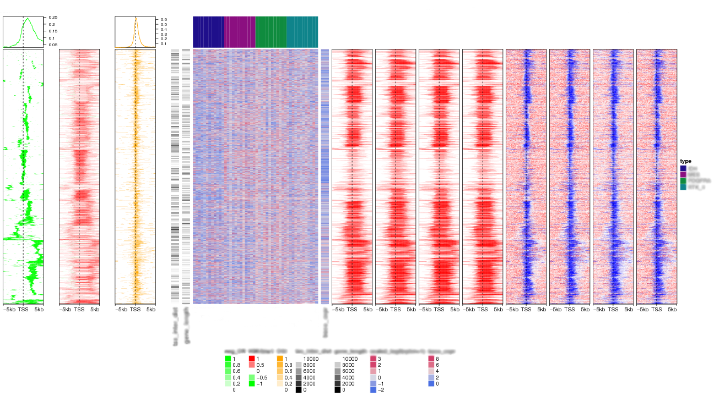

<!--
%\VignetteEngine{knitr}
%\VignetteIndexEntry{Make Enriched Heatmaps}
-->

Make Enriched Heatmaps
========================================

**Author**: Zuguang Gu ( z.gu@dkfz.de )

**Date**: `r Sys.Date()`

-------------------------------------------------------------

```{r, echo = FALSE, message = FALSE}
library(markdown)
options(markdown.HTML.options = c(options('markdown.HTML.options')[[1]], "toc"))

library(knitr)
knitr::opts_chunk$set(
    error = FALSE,
    tidy  = FALSE,
    message = FALSE,
    fig.align = "center")
options(markdown.HTML.stylesheet = "custom.css")

options(width = 100)
```

Enriched heatmap is a special type of heatmap which visualizes the enrichment of genomic signals
on specific target regions. It is broadly used to 
visualize e.g. how histone marks are enriched to transcription start sites.

There are several tools that can make such heatmap (e.g. [ngs.plot](https://github.com/shenlab-sinai/ngsplot) or [deepTools](https://github.com/fidelram/deepTools)).
Here we implement Enriched heatmap by **ComplexHeatmap** package. Since this type of heatmap is just a
normal heatmap but with some special settings, with the functionality of **ComplexHeatmap**, it would be much easier
to customize the heatmap as well as concatenating to a list of heatmaps to show correspondance between different data sources.

```{r, echo = FALSE, message = FALSE}
suppressPackageStartupMessages(library(EnrichedHeatmap))
```

```{r, eval = FALSE}
library(EnrichedHeatmap)
```

Load the example data that we will use for demostration:

```{r}
set.seed(123)
load(paste0(system.file("extdata", "chr21_test_data.RData", package = "EnrichedHeatmap")))
ls()
```

The example data are all `GRanges` objects:

- `H3K4me3`: coverage for H3K4me3 histone marks
- `cgi`: CpG islands
- `genes`: genes
- `meth`: methylation
- `rpkm`: gene expression

In order to build the vignette fast, the data only include chromosome 21.

## Single heatmap for histone marks

Heatmap for the enrichment of H3K4me3 histone mark on TSS:

```{r h3k4me3, fig.width = 3}
tss = promoters(genes, upstream = 0, downstream = 1)
tss[1:5]
H3K4me3[1:5]
mat1 = normalizeToMatrix(H3K4me3, tss, value_column = "coverage", 
    extend = 5000, mean_mode = "w0", w = 50)
mat1
EnrichedHeatmap(mat1, name = "H3K4me3")
```

`normalizeToMatrix()` converts the association between genomic signals (`H3K4me3`) and targets(`tss`) in to a matrix. 
It first splits the extended targets regions ( the extension to upstream and downstream is controlled by `extend` argument)
into a list of small windows (the width of the windows is controlled by `w`), then overlaps genomic signals to these small windows and calculates
the value for every small window which is the mean value of genomic signals that intersects with the window (the value
corresponds to genomic signals are controlled by `value_column` and how to calcualte the mean value is controlled by `mean_mode`).

There are several modes for `mean_mode` according to different types of genomic signals. It will be explained in latter sections. 

`EnrichedHeatmap()` returns a `EnrichedHeatmap` class instance which is inherited from `Heatmap` class,
so parameters and methods for `Heatmap` class can be directly applied to `EnrichedHeatmap` class.

There is a special column annotation function `anno_enriched()` which shows mean values of columns in 
the normalized matrix.

```{r anno, fig.width = 3}
EnrichedHeatmap(mat1, col = c("white", "red"), name = "H3K4me3",
    top_annotation = HeatmapAnnotation(lines = anno_enriched()), 
    top_annotation_height = unit(2, "cm"))
```

Rows can be smoothed by setting `smooth` to `TRUE` when generating the matrix. 
But since data range will change after smoothing,
you need to manually adjust the color mapping if you want to make figures comparable.

In following example, we use `colorRamp2()` from **circlize** package to define
a color mapping function.

```{r smooth, fig.width = 3}
library(circlize)
mat1_smoothed = normalizeToMatrix(H3K4me3, tss, value_column = "coverage", 
    extend = 5000, mean_mode = "w0", w = 50, smooth = TRUE)
# note we set the color range same as the unsmoothed matrix
EnrichedHeatmap(mat1_smoothed, col = colorRamp2(range(mat1), c("white", "red")), 
    name = "H3K4me3")
```

Since `EnrichedHeatmap` class is inherited from `Heatmap` class, it is easy to customize
the heatmap, e.g. split rows, make clustering on rows, add titles, ...

Split rows by a vector or a data frame:

```{r split, fig.width = 3}
EnrichedHeatmap(mat1, col = c("white", "red"), name = "H3K4me3", 
    split = sample(c("A", "B"), length(genes), replace = TRUE),
    column_title = "Enrichment of H3K4me3") 
```

Split rows by k-means clustering:

```{r kmeans, fig.width = 4}
EnrichedHeatmap(mat1, col = c("white", "red"), name = "H3K4me3", km = 3,
    column_title = "Enrichment of H3K4me3", row_title_rot = 0)
```

Split rows and add column annotation as well:

```{r, kmeans_anno, fig.width = 4}
EnrichedHeatmap(mat1, col = c("white", "red"), name = "H3K4me3",
    # note we have three row-clusters, so we assign three colors for the annotation lines
    top_annotation = HeatmapAnnotation(lines = anno_enriched(gp = gpar(col = 2:4))), 
    top_annotation_height = unit(2, "cm"),
    km = 3, row_title_rot = 0)
```

Cluster on rows:

```{r, cluster, fig.width = 3}
EnrichedHeatmap(mat1, col = c("white", "red"), name = "H3K4me3", 
    cluster_rows = TRUE, show_row_dend = FALSE, column_title = "Enrichment of H3K4me3")     
```

Some graphic settings specific for the `EnrichedHeatmap` object:

```{r aixs, fig.width = 3}
EnrichedHeatmap(mat1, col = c("white", "red"), name = "H3K4me3", 
    pos_line_gp = gpar(col = "blue", lwd = 2), axis_name = c("-5kb", "TSS", "5kb"), 
    axis_name_rot = -45, border = FALSE)
```

Extension to upstream and downstream can be controled by `extend` either by a single value
or a vector of length 2.

```{r extend, fig.width = 3}
# upstream 1kb, downstream 2kb
mat12 = normalizeToMatrix(H3K4me3, tss, value_column = "coverage", 
    extend = c(1000, 2000), mean_mode = "w0", w = 50)
EnrichedHeatmap(mat12, name = "H3K4me3", col = c("white", "red"))
```

## Single heatmap for methylation

Following heatmap visualizes the enrichment of low methylated regions on TSS:

```{r meth, fig.width = 3}
meth[1:5]
mat2 = normalizeToMatrix(meth, tss, value_column = "meth", mean_mode = "absolute",
    extend = 5000, w = 50, empty_value = 0.5)
EnrichedHeatmap(mat2, name = "methylation", column_title = "methylation near TSS")
```

With window size set to 50bp, it can be possible that there is no CpG site in some of 
the windows. In this case, `empty_value` is used to fill such windows. Since high methylation
and low methylation are the major methylation types in the genome, we set the empty value to 0.5.

Here we set `mean_mode` to `absolute`. Following illustrates different settings for ``mean_mode``:

```
        4      5      2     values in signal
     ++++++   +++   +++++   signal
       ================     window (16bp)
        4      3     3      overlap

  value for this window:
     absolute: (4 + 5 + 2)/3
     weighted: (4*4 + 5*3 + 2*3)/(4 + 3 + 3)
     w0:       (4*4 + 5*3 + 2*3)/16
```

So, according to above rules, if the genomic signals are from single base or very small regions, 
setting `mean_mode` to `absolute` seems to be reasonable. For other case, `mean_mode` can be set to
`weighted` or `w0`.

The target of the enrichment can not only be a single point but also can be regions with width larger than 1.
Following heatmap visualizes the enrichment of low methylation on CpG islands:

```{r cgi, fig.width = 3}
mat3 = normalizeToMatrix(meth, cgi, value_column = "meth", mean_mode = "absolute",
    extend = 5000, w = 50, empty_value = 0.5)
EnrichedHeatmap(mat3, name = "methylation", column_title = "methylation near CGI")
```

Width of the target regions can be controlled by `target_ratio` which is relative to
the width of the complete heatmap.

Target regions are also splitted into small windows, but since width of the target regions are different from each other, 
they are splitted by percent to their full width (the percent value is calculated automatically).

```{r fat_cgi, fig.width = 3}
mat3 = normalizeToMatrix(meth, cgi, value_column = "meth", mean_mode = "absolute",
    extend = 5000, w = 50, empty_value = 0.5, target_ratio = 0.3)
EnrichedHeatmap(mat3, name = "methylation", axis_name_rot = 90,
    column_title = "methylation near CGI")
```


## Multiple heatmaps

Thanks to the functionality of **ComplexHeatmap** package, heatmaps can be concatenated
by `+` operator. `EnrichedHeatmap` objects and `Heatmap` objects can be mixed.

Following heatmaps visualizes correspondance between H3K4me3 mark, methylation and
gene expression. It is quite straightforward to see high expression correlates
with low methylation and high promoter activity around TSS.

```{r list, fig.width = 6}
EnrichedHeatmap(mat1, col = c("white", "red"), name = "H3K4me3", width = 1) + 
EnrichedHeatmap(mat2, name = "methylation", width = 1) +
Heatmap(log2(rpkm+1), col = c("white", "orange"), name = "log2(rpkm+1)", 
    show_row_names = FALSE, width = unit(5, "mm"))
```

Of course you can split rows by splitting the main heatmap:

```{r list_split, fig.width = 7}
EnrichedHeatmap(mat1, col = c("white", "red"), name = "H3K4me3", km = 3, width = 1,
    top_annotation = HeatmapAnnotation(lines = anno_enriched()), 
    top_annotation_height = unit(2, "cm"), row_title_rot = 0,
    column_title = "H3K4me3") + 
EnrichedHeatmap(mat2, name = "methylation", width = 1,
    column_title = "Methylation") +
Heatmap(log2(rpkm+1), col = c("white", "orange"), name = "log2(rpkm+1)", 
    show_row_names = FALSE, width = unit(5, "mm"))
```


## Restrict overlapping by providing mapping

By default every genomic signal tries to intersect to every target region, but if mapping is
provided, only those genomic signals that are mapped to the corresponding target region will be kept.

To illustrate it more clearly, we load the example data. 
`gene` column in `neg_cr` is used to map to the names of `all_tss`.

```{r}
load(paste0(system.file("/extdata/neg_cr.RData", package = "EnrichedHeatmap")))
all_tss = promoters(all_genes, upstream = 0, downstream = 1)
all_tss = all_tss[unique(neg_cr$gene)]
neg_cr
all_tss
```

In this example, `neg_cr` contains regions that show negative correlation between methylation
and expression for the genes. The negative correlated regions are detected as:

1. extend genes to upstream 5kb and downtream 5kb;
2. for every gene, use a sliding window to go through left to right
    and find correlated regions by looking at the correlation between methylation in the window and expression for the gene.

Since genes may be close to each other, it is possible that one corrlated region for gene A
overlaps with gene B. This is not what we want and by specifying the mapping, we can correspond 
correlated regions to the correct genes.

```{r neg_cr, fig.width = 3}
mat4 = normalizeToMatrix(neg_cr, all_tss, mapping_column = "gene", w = 50, mean_mode = "w0")
EnrichedHeatmap(mat4, col = c("white", "green"), name = "neg_cr",
    top_annotation = HeatmapAnnotation(lines = anno_enriched(gp = gpar(col = "green"))), 
    top_annotation_height = unit(2, "cm"))
```

Above heatmap shows negative correlated regions are enriched at some distance after the TSS.
We guess it is because genes have alternative transcripts and negative correlated regions are
actually enriched at the start sites of transcripts.

Next we add another heatmap showing how transcripts are distributed to gene TSS. Maybe here the heatmap
is not a nice way for showing transcripts, but according to the annotation graphs on the both top, 
we can see there is a perfect fitting for the peaks of negative correlated regions and transcripts.

```{r neg_cr_with_tx, fig.width = 6}
mat5 = normalizeToMatrix(tx, all_tss, mapping_column="gene", w = 50, mean_mode = "w0")
ht_list = EnrichedHeatmap(mat4, col = c("white", "green"), name = "neg_cr",
              top_annotation = HeatmapAnnotation(lines1 = anno_enriched(gp = gpar(col = "green"))), 
              top_annotation_height = unit(2, "cm")) +
          EnrichedHeatmap(mat5, col = c("white", "black"), name = "tx",
              top_annotation = HeatmapAnnotation(lines2 = anno_enriched(gp = gpar(col = "black"))), 
              top_annotation_height = unit(2, "cm"))
draw(ht_list, gap = unit(1, "cm"))
```

## Features coming from ComplexHeatmap package

Since **EnrichedHeatmap** is built upon the **ComplexHeatmap** package, features in **ComplexHeatmap** can be
used directly for **EnrichedHeatmap**. As shown before, heatmaps can be split either by `km` or `spilt` arguments.

The order of rows can be retrieved by `row_order()`.

```{r, eval = FALSE}
ht_list = draw(ht_list)
row_order(ht_list)
```

If you are interested in a small cluster, under the interactive mode,
you can use mouse to select this region by `select()` function, and it will give you the order of rows
for the selected sub-region.

```{r, eval = FALSE}
draw(ht_list)
pos = select()
```

Since `EnrichedHeatmap` and `EnrichedHeamtapList` class are inherited from `Heamtap` and `HeamtapList` class
respectively, all advanced parameters in the latter two classes can be directly used in the former two classes.

E.g. to change graphic settings for the heatmap title:

```{r, eval = FALSE}
EnrichedHeatmap(..., column_title_gp = ...)
```

To change graphic settings for legends:

```{r, eval = FALSE}
EnrichedHeatmap(..., heatmap_legend_param = ...)
# or set is globally
ht_global_opt(...)
EnrichedHeatmap(...)
ht_global_opt(RESET = TRUE)
```

To set the width of the heatmaps if there are more than one heatmaps:

```{r, eval = FALSE}
EnrichedHeatmap(..., width = unit(...)) + EnrichedHeatmap(...)
```

For more advanced settings, please directly go to the vignettes in the **ComplexHeamtap** package.

Together with above features, you can make very complex heatmaps. Following example is from a real-world dataset.
Some information is hidden because the data is not published yet, but still, you can see it is really easy
to correspond different sources of information.

<p></p>

## Notice

Due to `findOverlaps()` in **GenomicRanges** package, `normalizeToMatrix()` may use 
a lot of memory if your `GRanges` object contains too many regions. `s` argument in `normalizeToMatrix()`
can split the data into `s` parts but it will increase the running time a lot.

If you generate the plot for the whole genome, I suggest you first save the figure as pdf format and then
convert to png by [`convert`](http://www.imagemagick.org/script/convert.php) software, instead of directly saving as png format.

## Session info

```{r}
sessionInfo()
```
