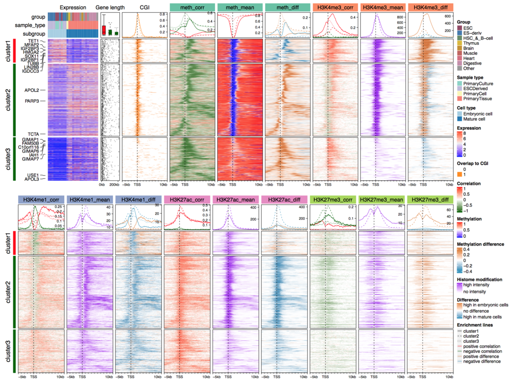

<!--
%\VignetteEngine{knitr}
%\VignetteIndexEntry{Visualize Comprehensive Associations in Roadmap dataset}
-->

Visualize Comprehensive Associations in Roadmap dataset
========================================

**Author**: Zuguang Gu ( z.gu@dkfz.de )

**Date**: `r Sys.Date()`

----------------------------------------

```{r, echo = FALSE, message = FALSE}
library(markdown)
options(markdown.HTML.options = c(options('markdown.HTML.options')[[1]], "toc"))

library(knitr)
knitr::opts_chunk$set(
    error = FALSE,
    warning = FALSE,
    message = FALSE)
options(markdown.HTML.stylesheet = "custom.css")
options(width = 100)
suppressPackageStartupMessages(library(circlize))
suppressPackageStartupMessages(library(EnrichedHeatmap))
```

In this vignette we visualize comprehensive associations between various
epigenomic signals from Roadmap dataset. Here, we describe the methods and
configurations used for visualizing the associations.

The preprocessing of Roadmap data to fit into the analysis is relatively
complex and is out of the scope of this package, thus here we only briefly
describe the methods we use to process the data, while provide more details
for the visualization part.

First load R packages and pre-calculated R objects which we will explain in
later sections.

```{r, results = "hide"}
library(EnrichedHeatmap)
library(GetoptLong)
library(circlize)
library(RColorBrewer)

download.file("https://jokergoo.github.io/supplementary/EnrichedHeatmap-supplementary/roadmap_normalized_matrices.RData",
    destfile = "roadmap_normalized_matrices.RData")
load("roadmap_normalized_matrices.RData")
file.remove("roadmap_normalized_matrices.RData")
```


## General overview

Roadmap dataset (http://egg2.wustl.edu/roadmap/web_portal/) covers various
human cell types and tissues and has been uniformly processed. The dataset
provides whole genome bisulfite sequencing data for DNA methylation, RNA
sequencing data for gene expression and ChIP sequencing data for various
histone modifications.

As we observed, gene expression shows stronger correlation pattern with DNA
methylation compared to other histone modifications, thus, the whole
integrative analysis is centered by gene expression and methylation, with
associating other histone modification signals, or in another words, we first
look for regions where gene expression and methylation is correlated, and as a
second step we check how histone modification signals correlate or
anti-correlate to these correlated regions.

For the Roadmap dataset, we only use 27 samples which have both matched
expression and methylation data with high data quality and have consistent
subgrouping in both expression and methylation datasets (results from an
unpublished study). Here `SAMPLE` contains annotations for samples under use
and `COLOR` contains the corresponding colors for annotations.

```{r}
SAMPLE
COLOR
```

The 27 samples are separated into two subgroups (labeled as `subgroup` column
in `SAMPLE`) where one subgroup (`subgroup1`) corresponds to embryonic stem
cells and the other subgroup (`subgroup2`) corresponds to primary tissues or
mature cells. Samples in the two subgroups show distinct difference in both
expression and methylation datasets (results from an unpublished study).

In this supplementary, we visualize the enrichment of various epigenomic
signals around gene TSS with upstream 5kb and downstream 10kb. All epigenomic
signals have already been normalized to gene TSS and stored as R objects
because the calculation for the matrices involves complex data preprocessing
and normalizing all datasets to gene TSS is time comsuing. However, we will
still provide pseudo code which generates these normalized matrices.

All epigenomic signals are normalized to gene TSS with same settings (upstream
5kb, downstream 10kb, window size 50bp), thus, all normalized matrices have
the same dimension and row order, and i^th row, j^th column in all matrices
correspond to a same position relative to a same gene.

There are following pre-calculated normalized matrices. Here we only simply
describe these objects and details for generating them will be explained in
later sections.

- `mat_neg_cr`: a normalized matrix for correlated regions (CRs, The
  definition of CR is introduced in following sections) showing significant
  negative correlation between methylation and gene expression. The value in
  the matrix is whether a window is covered by negative CRs (values are 0 or
  1).
- `meth_mat_corr`: a normalized matrix for all CRs. The value in the matrix is
  the mean correlation for CRs overlapped to a window.
- `meth_mat_mean`: a normalized matrix for mean methylation across all
  samples.
- `meth_mat_diff`: a normalized matrix for mean methylation difference between
  two subgroups.
- `mat_cgi`: a normalized matrix for CpG islands. The value in the matrix is
  whether a window is covered by CGIs.
- `hist_mat_corr_list`: a list of normalized matrices for the correlation
  between histone modification signals and gene expression. Each matrix
  corresponds to one type of histone modification.
- `hist_mat_mean_list`: a list of normalized matrices for the mean histone
  modification signals across all samples.
- `hist_mat_diff_list`: a list of normalized matrices for the histone
  modification signal difference between two subgroups.

Other R objects are

- `gene`: A `GRanges` object which contains positions of genes.
- `tss`: A `GRanges` object which contains positions of gene TSS.
- `gene_symbol` a mapping between Ensembl IDs and gene symbols.
- `expr`: gene expression matrix (Values are measured by `log2(RPKM + 1)`).

`tss` and `expr` also have the same row order as normalized matrices.

## Association between gene expression and methylation

When looking for associations between DNA methylation and gene expression, the
process is gene centric. We briefly describe the method as follows:

Each gene is extended to upstream 50kb and downstream 50kb to the full gene
body. For each extended gene, we use a 6-CpG sliding window with step of 3
CpGs and with maximum window size of 10kb. In each window, mean methylation is
calculated from the 6-CpG sites and the Spearman correlation as well as the
correlaion test to expression of the current gene is calculated. We term these
6 CpG windows as correlated regions (CRs) and significant CRs are filterred by
FDR < 0.05 (from the correlation test) and methylation difference between the
two subgroups are larger than 0.2.

According to this procedure, each CR belongs to one certain gene, which means,
there is a mapping between CRs and genes. Thus when normalizing CRs to TSS,
this mapping should be provided so that CRs can be correctly normalized to
their host genes. Or else there can be scenarios that two extended genes
overlap to each other and one CR of gene A also overlaps to gene B. If the
mapping is not provided, this CR will be wrongly mapped to gene B.

Assume `cr` contains CRs for all 6-CpG windows and the gene name column is
named as `gene_id`, the correlation column is named as `corr`, following code
normalizes CRs to TSS.

```{r, eval = FALSE}
# this chunk of code is only for demonstration
mat_corr = normalizeToMatrix(cr, tss, mapping_column = "gene_id", value_column = "corr", 
    mean_mode = "absolute", ...)
```

Assume `sig_neg_cr` contains CRs showing significant negative correlations to
expression, following code normalizes significant negative CRs to TSS. Note
there is no `value_column` in following code so that the normalized matrix
measures whether each window is covered by `sig_neg_cr`.

```{r, eval = FALSE}
# this chunk of code is only for demonstration
mat_neg_cr = normalizeToMatrix(sig_neg_cr, tss, mapping_column = "gene_id", 
    mean_mode = "absolute", ...)
```

The correlation itself does not tell the methylation level (highly methylated
or lowly methylated) nor the variability of methylation among samples. In
order to get a more comprehensive view of the methylation, we also normalize
mean methylation and methylation variability to TSS. Methylation data
represents as a matrix where rows are CpG sites and columns are samples, thus
we directly calculate mean methylation among samples with row means, then
normalize the mean methylation to gene TSS.

In following code, assume `meth` is a `GRanges` object of CpG sites and meta
data columns contain methylation matrix for all samples.

```{r, eval = FALSE}
# this chunk of code is only for demonstration
meth_mean = meth
mcols(meth_mean) = data.frame(mean_meth = rowMeans(mcols(meth)))
meth_mat_mean = normalizeToMatrix(meth_mean, tss, value_column = "mean_meth", 
    mode = "absolute", ...)
```

And the mean methylation difference is calculated as $m_1 - m_2$ where $m_1$
is the mean methylation matrix in subgroup 1 and $m_2$ is the mean methylation
in subgroup 2.

```{r, eval = FALSE}
# this chunk of code is only for demonstration
meth_mean_1 = meth
mcols(meth_mean_1) = data.frame(mean_meth = rowMeans(mcols(meth[, SAMPLE$subgroup == "subgroup1"])))
meth_mat_mean_1 = normalizeToMatrix(meth_mean_1, tss, value_column = "mean_meth", 
    mode = "absolute", ...)
meth_mean_2 = meth
mcols(meth_mean_2) = data.frame(mean_meth = rowMeans(mcols(meth[, SAMPLE$subgroup == "subgroup2"])))
meth_mat_mean_2 = normalizeToMatrix(meth_mean_2, tss, value_column = "mean_meth", 
    mode = "absolute", ...)
meth_mat_diff = meth_mat_mean_1 - meth_mat_mean_2
```

Since CRs are detected in upstream 50kb and downstream 50kb of the full gene,
while for the visualizaiton, only upstream 5kb and downstream 10kb of TSS are
used, genes which do not have a significant negative CR in [-5kb, 10kb] of TSS
are removed (can be filtered by `rowSums(mat_neg_cr) > 0`), which finnally
results in `r length(tss)` genes for the analysis.

```{r}
length(tss)
```

## Association with histone modifications

We use following four types of histone modifications which show specific
patterns at gene TSS: H3K4me1, H3K4me3, H3K27ac and H3K27me3. Similar as
methylation, for each type of histone modification, there are three matrices
which are 1. correlation to gene expression; 2. mean signals across all
samples; and 3. the mean signal difference between two subgroups.

Being different from methylation datasets, the peak regions of histone
modification data across all samples cannot locate at a same genomic position
which makes it naturelly not a matrix-like data. To format it, we normalize
signals to gene TSS for eash sample separately, which generates a list of
matrices with same dimensions and settings.

Assume `peak` is a list of `GRanges` objects for peak regions in different
samples. In following, we additionally set `keep = c(0, 0.99)` to adjust
outlier values which are larger than 99th percentile.

```{r, eval = FALSE}
# this chunk of code is only for demonstration
for(i in n_sample) {
    # assume the column name for the signals is called 'density'
    hm_list[[i]] = normalizeToMatrix(peak[[i]], tss, value_column = "density", keep = c(0, 0.99))
}
```

If we compress the list of matrices as a three-dimension array where the first
dimension corresponds to genes, the second dimension corresponds to windows
and the third dimension corresponds to samples, the mean signal across all
sample can be calculated on the third dimension. Here `getSignalsFromList()`
simplifies this job.
 
```{r, eval = FALSE}
# this chunk of code is only for demonstration
hm_mat_mean = getSignalsFromList(hm_list, mean)
```

The mean difference between two subgroups can be calculated in a similar way:

```{r, eval = FALSE}
# this chunk of code is only for demonstration
# hm_list_1 and hm_list_2 are normalized matrices for subgroup1 and subgroup2 separatedly
hm_mat_mean_1 = getSignalsFromList(hm_list_1, mean)
hm_mat_mean_2 = getSignalsFromList(hm_list_2, mean)
hm_mat_diff = hm_mat_mean_1 - hm_mat_mean_2
```

The correlation between histone modification and gene expression can also be
calculated on the third dimension of the array. In the user-defined function
`fun`, `x` is the vector for gene i and window j in the array, and `i` is the
index of current gene.

```{r, eval = FALSE}
# this chunk of code is only for demonstration
hm_corr = getSignalsFromList(hm_list, fun = function(x, i) {
    cor(x, expr[i, ], method = "spearman") # x = array[i, j, ]
})
```

We apply this method on all four types of histone modifications and normalized
matrices are stored as `hist_mat_corr_list`, `hist_mat_mean_list` and
`hist_mat_diff_list`. All three objects are list of four matrices.

## normalize CGI to gene TSS

Normalizing CpG islands to TSS is straightforward. The value in the normalized
matrix is whether each window is covered by CpG islands.

```{r, eval = FALSE}
# this chunk of code is only for demonstration
mat_cgi = normalizeToMatrix(cgi, tss, mean_mode = "absolute", ...)
```

## Order and group genes

The ordering of genes and sometimes separating genes into several groups are
important to strenghen the effect of visualization of the patterns. Especially
when we have multiple heatmaps which share same row order, a proper way to
order genes is more important to highlight patterns for all heatmaps.

Which method to order genes depends on what pattern users want to reveal. In
this analysis, the message we want to show from the heatmaps are 1. the
enrichment of significantly negatively correlated regions (negCRs) around TSS;
2. the difference between subgroup 1 and subgroup 2; and 3. the different
methylation patterns for different genes. The following procedures shows how
we group genes and how we order genes for better showing these patterns.

The expression difference between subgroup 1 and subgroup 2 samples is a major
grouping factor. We construct a category vector which corresponds to high
expression and low expression in subgroup 1.

```{r expr_split}
expr_mean = rowMeans(expr[, SAMPLE$subgroup == "subgroup1"]) - 
    rowMeans(expr[, SAMPLE$subgroup == "subgroup2"])
expr_split = ifelse(expr_mean > 0, "high", "low")
expr_split = factor(expr_split, levels = c("high", "low"))
```

After looking at the methylation data, we found the methylation shows big
difference between genes and the major difference happens at small areas
around TSS and flanks more to the downstream of TSS. Thus, we only extract 20%
of upstream of TSS and 40% of downstream of TSS and use methylation to
separate genes into two subgroups which are low TSS-methylation group and high
TSS-methylation group.

The label of methylation groups are adjsuted that the first group always has
lowest mean TSS-methylation.

```{r meth_split}
set.seed(123)
upstream_index = length(attr(meth_mat_mean, "upstream_index"))
meth_split = kmeans(meth_mat_mean[, seq(round(upstream_index*0.8), round(upstream_index*1.4))], 
    centers = 2)$cluster
x = tapply(rowMeans(meth_mat_mean[, seq(round(upstream_index*0.8), round(upstream_index*1.4))]), 
    meth_split, mean)
od = structure(order(x), names = names(x))
meth_split = paste0("cluster", od[as.character(meth_split)])
```

Both grouping from expression and methylation is important, thus To make a
more informative grouping of genes, the split from expression and methylation
are combined:

```{r}
combined_split = paste(meth_split, expr_split, sep = "|")
```

There is one combined group with too few number of genes

```{r}
tb = table(combined_split)
tb
tb["cluster2|high"]/sum(tb)
```

The proprotion of "cluster2|high" group is too small and also we don't want to
make too many row clusters, in order to make the plot more clear,
"cluster2|high" is removed from the analysis.

Also all related variables should be subsetted to remove "cluster2\|high"
genes.

```{r subset}
l = combined_split != "cluster2|high"
tss = tss[l]
expr = expr[l, ]
hist_mat_corr_list = lapply(hist_mat_corr_list, function(x) x[l, ])
hist_mat_mean_list = lapply(hist_mat_mean_list, function(x) x[l, ])
hist_mat_diff_list = lapply(hist_mat_diff_list, function(x) x[l, ])
mat_neg_cr = mat_neg_cr[l, ]
mat_cgi = mat_cgi[l, ]
meth_mat_corr = meth_mat_corr[l, ]
meth_mat_mean = meth_mat_mean[l, ]
meth_mat_diff = meth_mat_diff[l, ]
expr_split = expr_split[l]
meth_split = meth_split[l]
combined_split = combined_split[l]
n_row_cluster = length(unique(combined_split))
```

Next we calculate row order, following is a way which shows clear patterns for
all signals.

From heatmaps which we show later, there is a clear pattern that the negCRs
are enriched at consistent positions downstream of TSS. To show this specific
pattern, we designed a specific distance metric which calculates how close the
negCRs on two genes are based on relative distance to TSS.

For two rows in the normalized matrix, assume $a_1, a_2, ..., a_{n_1}$ are the
window indices for one gene which overlaps with negative correlated regions
and $b_1, b_2, ... b_{n_2}$ are the indices for the other gene, the distance
which is based on closeness of the overlapped windows in the two genes is
defined as:

   $$ d_{closeness} = \frac{\sum_{i=1}^{n_1} \sum_{j=1}^{n_2} {|a_i - b_j|}}{n_1 \cdot n_2}$$

Following code calculates row orders for genes. For each row cluster split by
`combined_split`, rows are clustered separately. In following code, `l_list`
is a logical partition of genes and for each row cluster.

```{r row_order}
merge_row_order = function(l_list) {
  do.call("c", lapply(l_list, function(l) {
    if(sum(l) == 0) return(integer(0))
    if(sum(l) == 1) return(which(l))
    dend1 = as.dendrogram(hclust(dist_by_closeness(mat_neg_cr[l, ])))
    dend1 = reorder(dend1, -enriched_score(mat_neg_cr[l, ]))
    od = order.dendrogram(dend1)
    which(l)[od]
  }))
}

row_order = merge_row_order(list(
  combined_split == "cluster1|high",
  combined_split == "cluster1|low",
  combined_split == "cluster2|low"
))
```

## Organize heatmaps

After all matrics are generated, we can generate the complex heatmap list.

First we prepare the heatmap for expression. The columns of expression matrix
are only clustered for each subgroup.

```{r column_order}
dend1 = as.dendrogram(hclust(dist(t(expr[, SAMPLE$subgroup == "subgroup1"]))))
hc1 = as.hclust(reorder(dend1, colMeans(expr[, SAMPLE$subgroup == "subgroup1"])))
expr_col_od1 = hc1$order
dend2 = as.dendrogram(hclust(dist(t(expr[, SAMPLE$subgroup == "subgroup2"]))))
hc2 = as.hclust(reorder(dend2, colMeans(expr[, SAMPLE$subgroup == "subgroup2"])))
expr_col_od2 = hc2$order
expr_col_od = c(which(SAMPLE$subgroup == "subgroup1")[expr_col_od1], 
              which(SAMPLE$subgroup == "subgroup2")[expr_col_od2])
```

The first heatmap is the expression which is a normal heatmap where we put
sample annotations on top.

```{r}
ht_list = Heatmap(expr, name = "expr", show_row_names = FALSE,
    show_column_names = FALSE, width = unit(4, "cm"), show_column_dend = FALSE, 
    cluster_columns = FALSE, column_order = expr_col_od,
    top_annotation = HeatmapAnnotation(df = SAMPLE[, -1], col = COLOR, 
        show_annotation_name = TRUE, annotation_name_side = "left"),
    column_title = "Expression", column_title_gp = gpar(fontsize = 12),
    show_row_dend = FALSE, use_raster = TRUE, raster_quality = 2)
```

We extract top 20 genes with most significant p-values simply by t-test.

```{r}
library(genefilter)
df = rowttests(expr, factor(SAMPLE$subgroup))
top_genes = rownames(df[order(df$p.value)[1:20], ])
```

These top genes are added as a text annotation.

```{r}
index =  which(rownames(expr) %in% top_genes)
labels = gene_symbol[rownames(expr)[index]]
ht_list = rowAnnotation(sig_gene = row_anno_link(at = index, labels = labels,
        side = "left", labels_gp = gpar(fontsize = 10), link_width = unit(5, "mm"), 
        padding = 0.5, extend = unit(c(1, 0), "cm")), 
    width = max_text_width(labels, gp = gpar(fontsize = 10)) + unit(5, "mm")) + ht_list
```

On the right side of the expression is a row annotation which show the length of genes,
constructed by `rowAnnotation()` function and appended to the heatmap list.

```{r}
gl = width(gene[names(tss)])
gl[gl > quantile(gl, 0.95)] = quantile(gl, 0.95)
ht_list = ht_list + rowAnnotation(gene_len = anno_points(gl, size = unit(1, "mm"), 
    gp = gpar(col = "#00000040")), 
  width = unit(1.5, "cm"))
```

Add the heatmap which shows enrichment of CGI to TSS. Top annotation which
shows enrichment pattern is added by `anno_enriched()` function.

```{r}
axis_name = c("-5kb", "TSS", "10kb")
ht_list = ht_list + EnrichedHeatmap(mat_cgi, col = c("white", "darkorange"), name = "CGI",
  column_title = "CGI", column_title_gp = gpar(fontsize = 12),
  top_annotation = HeatmapAnnotation(lines = anno_enriched(gp = gpar(col = "darkorange", 
    lty = 1:n_row_cluster), yaxis_facing = "left")), 
  axis_name = axis_name, axis_name_gp = gpar(fontsize = 8), use_raster = TRUE, raster_quality = 2) 
```

Add the heatmap which shows the correlation between methylation and
expression. Since in the normalized matrix `meth_mat_corr`, there are positive
correlations and negative correlations, both `pos_col` and `neg_col` are set
so that enrichment for positive correlation and negative correlation are drawn
separately in the top annotation.

```{r}
cor_col_fun = colorRamp2(c(-1, 0, 1), c("darkgreen", "white", "red"))
ht_list = ht_list + EnrichedHeatmap(meth_mat_corr, col = cor_col_fun, name = "meth_corr", 
  top_annotation = HeatmapAnnotation(lines = anno_enriched(gp = gpar(pos_col = "red", 
    neg_col = "darkgreen", lty = 1:n_row_cluster), yaxis_facing = "left")), 
  column_title = "meth_corr", column_title_gp = gpar(fontsize = 12),
    axis_name = axis_name, axis_name_gp = gpar(fontsize = 8), use_raster = TRUE, raster_quality = 2)
```

Add the heatmap which shows mean methylation among all samples.

```{r}
meth_col_fun = colorRamp2(c(0, 0.5, 1), c("blue", "white", "red"))
ht_list = ht_list + EnrichedHeatmap(meth_mat_mean, col = meth_col_fun, name = "meth_mean", 
  column_title = "meth_mean", column_title_gp = gpar(fontsize = 12),
  top_annotation = HeatmapAnnotation(lines = anno_enriched(gp = gpar(col = "red", 
    lty = 1:n_row_cluster), yaxis_facing = "left")),
  , axis_name = axis_name, axis_name_gp = gpar(fontsize = 8), use_raster = TRUE, raster_quality = 2)
```

For the heatmap showing difference between subgroups, we define a function
which generate color mappings showing symmetric color mapping for positive
difference and negative difference. This works for both methylation difference
and histone modification difference.

```{r}
generate_diff_color_fun = function(x) {
  q = quantile(x, c(0.05, 0.95))
  max_q = max(abs(q))
  colorRamp2(c(-max_q, 0, max_q), c("#3794bf", "#FFFFFF", "#df8640"))
}

ht_list = ht_list + EnrichedHeatmap(meth_mat_diff, name = "meth_diff", col = generate_diff_color_fun(meth_mat_diff),
  column_title = "meth_diff", column_title_gp = gpar(fontsize = 12),
  top_annotation = HeatmapAnnotation(lines = anno_enriched(gp = gpar(pos_col = "#df8640", 
    neg_col = "#3794bf", lty = 1:n_row_cluster), yaxis_facing = "left")),
  axis_name = axis_name, axis_name_gp = gpar(fontsize = 8), use_raster = TRUE, raster_quality = 2)
```

Since here in the final heamtap list, there are 17 heatmaps which are too many
to put in one row layout. Thus, we separate the heatmaps into two and assign
them to `ht_list_1` and `ht_list_2`. In following code, the heatmaps for the
last three histone modifications are assigned to the second heatmap list.


```{r}
ht_list_2 = NULL
ht_list_1 = NULL
mark_name = names(hist_mat_corr_list)
for(i in seq_along(hist_mat_corr_list)) {
    # heatmaps for the 2nd, 3th and 4th histone modifications are assigned to a new `ht_list`
  if(i == 2) {
    ht_list_1 = ht_list
    ht_list = NULL
  }

  ht_list = ht_list + EnrichedHeatmap(hist_mat_corr_list[[i]], col = cor_col_fun, 
    name = qq("@{mark_name[i]}_corr"), column_title = qq("@{mark_name[i]}_corr"), 
    top_annotation = HeatmapAnnotation(lines = anno_enriched(gp = gpar(pos_col = "red",
      neg_col = "darkgreen", lty = 1:n_row_cluster), yaxis_facing = "left")), 
    top_annotation_height = unit(2, "cm"), 
    axis_name = axis_name, axis_name_gp = gpar(fontsize = 8), use_raster = TRUE, raster_quality = 2)

    ht_list = ht_list + EnrichedHeatmap(hist_mat_mean_list[[i]], 
      col = colorRamp2(c(0, quantile(hist_mat_mean_list[[i]], 0.95)), c("white", "purple")), 
      name = qq("@{mark_name[i]}_mean"), column_title = qq("@{mark_name[i]}_mean"), 
      column_title_gp = gpar(fontsize = 12),
    top_annotation = HeatmapAnnotation(lines = anno_enriched(gp = gpar(col = "purple", 
      lty = 1:n_row_cluster), yaxis_facing = "left")),
    axis_name = axis_name, axis_name_gp = gpar(fontsize = 8), use_raster = TRUE, raster_quality = 2)

  ht_list = ht_list + EnrichedHeatmap(hist_mat_diff_list[[i]], 
    col = generate_diff_color_fun(hist_mat_diff_list[[i]]), 
        name = qq("@{mark_name[i]}_diff"), column_title = qq("@{mark_name[i]}_diff"), 
    column_title_gp = gpar(fontsize = 12), 
    top_annotation = HeatmapAnnotation(lines = anno_enriched(gp = gpar(pos_col = "#df8640", 
      neg_col = "#3794bf", lty = 1:n_row_cluster), yaxis_facing = "left")),
    axis_name = axis_name, axis_name_gp = gpar(fontsize = 8), use_raster = TRUE, raster_quality = 2)

}
ht_list_2 = ht_list
```


We assign same `split` and `row_order` to both heatmap lists so that they can
be correctedly corresponded.

All heatmaps are split by `combined_split`. Here we rename values in
`combined_split` to `cluster1`, `cluster2` and `cluster3`.

```{r}
split = as.vector(combined_split)
split[combined_split == "cluster1|high"] = "cluster1"
split[combined_split == "cluster1|low"] = "cluster2"
split[combined_split == "cluster2|low"] = "cluster3"
```

For each heatmap list, a single column heatmap (or bar) is attached to the
most left side to represent difference of expression between subgroups.

```{r}
ht_list_1 = Heatmap(expr_split, show_row_names = FALSE, name = "expr_diff", 
  col = c("high" = "red", "low" = "darkgreen"), 
  show_column_names = FALSE, width = unit(2, "mm")) + ht_list_1
```

Now we explictly use `draw()` function to make the heatmaps because there are
some global settings for all heatmaps. We also decorate the final heatmap such
as adding labels and axes.

```{r, fig.width = 14, fig.height = 8}
ht_list_1 = draw(ht_list_1, 
  cluster_rows = FALSE, row_order = row_order, show_row_dend = FALSE,
  split = split, heatmap_legend_side = "bottom", gap = unit(2, "mm"))

add_boxplot_of_gene_length = function(ht_list) {
  
  row_order_list = row_order(ht_list)
  lt = lapply(row_order_list, function(ind) gl[ind])
  bx = boxplot(lt, plot = FALSE)$stats
  n = length(row_order_list)
  x_ind = (seq_len(n) - 0.5)/n
  w = 1/n*0.5
  decorate_annotation("gene_len", slice = 1, {
    rg = range(bx)
    rg[1] = rg[1] - (rg[2] - rg[1])*0.1
    rg[2] = rg[2] + (rg[2] - rg[1])*0.1
    pushViewport(viewport(y = unit(1, "npc") + unit(1, "mm"), just = "bottom", height = unit(2, "cm"), yscale = rg))
    grid.rect(gp = gpar(col = "black"))
    grid.segments(x_ind - w/2, bx[5, ], x_ind + w/2, bx[5, ], default.units = "native", gp = gpar(lty = 1:n))
    grid.segments(x_ind - w/2, bx[1, ], x_ind + w/2, bx[1, ], default.units = "native", gp = gpar(lty = 1:n))
    grid.segments(x_ind, bx[1, ], x_ind, bx[5, ], default.units = "native", gp = gpar(lty = 1:n))
    grid.rect(x_ind, colMeans(bx[c(4, 2), ]), width = w, height = bx[4, ] - bx[2, ], default.units = "native", 
      gp = gpar(fill = "white", lty = 1:n))
    grid.segments(x_ind - w/2, bx[3, ], x_ind + w/2, bx[3, ], default.units = "native", gp = gpar(lty = 1:n))
    grid.text("Gene length", y = unit(1, "npc") + unit(2.5, "mm"), gp = gpar(fontsize = 12), just = "bottom")
    upViewport()
  })
}

add_boxplot_of_gene_length(ht_list_1)
# add background rectangles for column titles
i = 0
for(f in names(ht_list_1@ht_list)) {
  if(grepl("meth|H3K4me1|H3K4me3|H3K27ac|H3K27me3", f)) {
    decorate_column_title(f, {
      grid.rect(height = unit(0.8, "npc"), gp = gpar(fill = brewer.pal(8, "Set2")[as.integer(i/3)+1], col = NA))
      grid.text(ht_list_1@ht_list[[f]]@column_title, gp = gpar(fontsize = 12))
    })
    i = i + 1
  }
}
# axis for "Gene length" annotation
decorate_annotation("gene_len", slice = n_row_cluster, {
  grid.segments(c(0, 200000), unit(0, "npc"), c(0, 200000), unit(-1, "mm"), default.units = "native")
  grid.text("0kb", unit(0, "native") - unit(2, "mm"), unit(-2, "mm"), gp = gpar(fontsize = 8), just = c("left", "top"))
  grid.text("200kb", unit(200000, "native") + unit(1, "mm"), unit(-2, "mm"), gp = gpar(fontsize = 8), 
    just = c("right", "top"))
}) 
```

`split` and `row_order` are set to the second heatmap list as well.

```{r, fig.width = 14, fig.height = 8}
ht_list_2 = Heatmap(expr_split, show_row_names = FALSE, name = "expr_diff", 
  col = c("high" = "red", "low" = "darkgreen"), 
  show_column_names = FALSE, width = unit(2, "mm")) + ht_list_2
ht_list_2 = draw(ht_list_2,
  cluster_rows = FALSE, row_order = row_order, show_row_dend = FALSE,
  split = split, heatmap_legend_side = "bottom", gap = unit(2, "mm"))
for(f in names(ht_list_2@ht_list)[-1]) {
  decorate_column_title(f, {
    grid.rect(height = unit(0.8, "npc"), gp = gpar(fill = brewer.pal(8, "Set2")[as.integer(i/3)+1], col = NA))
    grid.text(ht_list_2@ht_list[[f]]@column_title, gp = gpar(fontsize = 12))
  })
  i = i + 1
}
```

Note rows in the two heatmap list are all the same.

Following code only extracts the annotation graphics. We put all the
annotation graphics in a layout so that it is easily to compare between them.

```{r, fig.width = 14, fig.height = 7}
add_anno_enriched = function(ht_list, name, ri, ci) {
  pushViewport(viewport(layout.pos.row = ri, layout.pos.col = ci))
  extract_anno_enriched(ht_list, name, newpage = FALSE)
  upViewport()
}

pushViewport(viewport(layout = grid.layout(nr = 3, nc = 6)))
add_anno_enriched(ht_list_1, "meth_corr",     1, 1)
add_anno_enriched(ht_list_1, "meth_mean",     1, 2)
add_anno_enriched(ht_list_1, "meth_diff",     1, 3)
add_anno_enriched(ht_list_1, "CGI",           1, 4)
add_anno_enriched(ht_list_1, "H3K4me3_corr",  2, 1)
add_anno_enriched(ht_list_1, "H3K4me3_mean",  2, 2)
add_anno_enriched(ht_list_1, "H3K4me3_diff",  2, 3)
add_anno_enriched(ht_list_2, "H3K4me1_corr",  2, 4)
add_anno_enriched(ht_list_2, "H3K4me1_mean",  2, 5)
add_anno_enriched(ht_list_2, "H3K4me1_diff",  2, 6)
add_anno_enriched(ht_list_2, "H3K27ac_corr",  3, 1)
add_anno_enriched(ht_list_2, "H3K27ac_mean",  3, 2)
add_anno_enriched(ht_list_2, "H3K27ac_diff",  3, 3)
add_anno_enriched(ht_list_2, "H3K27me3_corr", 3, 4)
add_anno_enriched(ht_list_2, "H3K27me3_mean", 3, 5)
add_anno_enriched(ht_list_2, "H3K27me3_diff", 3, 6)
upViewport()
```

## Interpretation

Following figure puts the two heatmap lists into one plotting page
and arranges legends to the right of the heatmaps.



Generally, genes in cluster 1 and 2 have high expression, long gene length
(annotation "Gene length") and low methylation over TSS (heatmap "meth_mean")
which correspond well with the enrichment of CpG islands over TSS (heatmap
"CGI"), while genes in cluster 3 have low expression, short gene length, and
intermediate mean methylation with almost none CGIs overlapping TSS. There is
enrichment for significant negative CRs (negCRs) downstream of TSS in cluster
1 and cluster 2 (solid and dashed green lines in annotation of "meth_corr"
heatmap, the peaks of the enrichment locate at approximately +2kb of TSS.)
while for cluster 3 genes, the enrichment of negCRs is very close to TSS. By
associating the heatmap "CGI", "meth_corr", "meth_mean" and "meth_diff"
together, we can make the conclusion that for genes in cluster 1 and cluster
2, negCRs are enriched at the downstream border of CGI over TSS with high
methylation variability, and even for cluster 3 genes, there is also a trend
that the negCRs are enriched at close downstream of TSS. It might give
hypotheses that when the transcription machine moves into the gene body from
TSS, these exist some mechanism that blocks this process and reflects on the
changes of methylations.

H3K4me3 is a histone mark which is enriched at active TSS or promoters.
Heatmap "H3K4me3_mean" shows strong enrichment of the mean signal over TSS for
cluster 1 and cluster 2 genes with high expression. Such enrichment corresponds very
well to the low TSS-methylation. Interestingly, strong positive correlation to
expression dominates in cluster 1 and the signals are significantly higher in
embryonic cells (heatmap "H3K4me3_diff"). The peak for the enrichment of
correlation signals in cluster 1 (solid red line in annotation of heatmap
"H3K4me3_corr") is broader than the mean signals while it is very similar as
the enrichment peak for negCRs. For cluster 2 genes, the positive correlated
regions are enriched at downstream border of H3K4me3 peaks while directly at
the H3K4me3 peaks shows negative correlation although the correlation signals
are weak and signal difference is small. Surprisingly, strong positive
correlations dominate cluster 3 although the mean signals selves are very
weak.

H3K4me1 is an active mark enriched at enhancers and promoter flanking regions.
Nevertheless, it shows negative correlation at the TSS (solid and dashed green
lines in annotation of heatmap "H3K4me1_corr"), especially strong for cluster
1. The peak for the negative correlation enrichment correlates well with CGI
and low TSS-methylation, however the signals selves are low at TSS (heatmap
"H3K4me1_mean"). Flanking TSS is dominated by positive correlations and the
signal difference is comparably big in cluster 1 (solid brown line in
annotation of heatmap "H3K4me1_diff").

H3K27ac is also an active mark enriched in both active enhancers and
promoters, and it generally shows positive correlations to expression in all
three clusters (heatmap "H3K27ac_corr"). Interestingly the mean signals are
the strongest in cluster 2 and mature cells have significantly higher signal
intensity than embryonic cells (dashed blue line in annotation of heatmap
"H3K27ac_diff"). The peak for the correlation signal enrichment is comparably
broader than other marks.

H3K27me3 is a repressive mark and it generally shows negative correlation
around TSS at relatively low level, excluding cluster 1 where there are no
dominant correlation patterns (heatmap "H3K27me3_corr"). The signals selves
are lower and sparser compared to other marks.


## Session Info

```{r}
sessionInfo()
```


